# Three.js WebGPU Skill Pack for TSL, Procedural Graphics, and Visual Validation

Specialized agent skills for building general-purpose Three.js WebGPU scenes
with a TSL-first architecture, workload-driven algorithm selection, procedural
graphics systems, explicit low-power/mobile accounting, and falsifiable visual
validation.

[](https://skills.sh/linegel/threejs-complete-set-of-skill)

**Website:** <https://threejs-skills.com/> ·
**LLM overview:** [llms.txt](https://threejs-skills.com/llms.txt) ·
**Machine-readable index:** [skills.json](https://threejs-skills.com/skills.json)

## Install

Each skill is a self-contained folder (`SKILL.md` with YAML frontmatter,
`references/`, `agents/`, runnable `examples/`), so any agent that reads local
files can use the pack.

The preferred install path is the open skills CLI:

```bash
npx skills@latest add linegel/threejs-complete-set-of-skill --list
npx skills@latest add linegel/threejs-complete-set-of-skill --skill '*'
```

For a specific agent in non-interactive setup:

```bash
npx skills@latest add linegel/threejs-complete-set-of-skill --skill '*' -g -a codex -y
npx skills@latest add linegel/threejs-complete-set-of-skill --skill '*' -g -a claude-code -y
```

For runtimes that do not support `npx skills@latest add` yet:

- **Claude Code**: install with `-a claude-code`, or `git clone` this repo and
  symlink/copy the `threejs-*` folders into `~/.claude/skills/` or a project
  `.claude/skills/` directory.
- **Codex CLI**: install with `-a codex`, or clone the repo and reference it
  from `AGENTS.md`: "for Three.js WebGPU work, read the matching
  `threejs-*/SKILL.md`".
- **Cursor / other IDE agents**: add as a submodule and point a rule at the
  skill folders.
- **Gemini CLI / generic agents**: clone and instruct the agent to load the
  relevant `SKILL.md`.

After installing the whole pack, use `threejs-choose-skills` as the in-pack
router for broad requests. It is not the recommended standalone install target.

Discovery metadata is available at [`skills.json`](skills.json) in the repo
root and at <https://threejs-skills.com/skills.json>.

This is not a generic Three.js tutorial. It is a practical skill pack for
agents that need to design, implement, debug, and validate advanced real-time
graphics systems: scientific or explanatory views, inspected products and
assemblies, environments, procedural worlds, particles, cameras, post
pipelines, shadows, water, clouds, and GPU-backed surface effects. The router
must report a missing owner rather than stretch a domain skill over unsupported
data, semantic-scene, or lighting work.

Use this repository when an agent needs current Three.js WebGPU guidance for
procedural oceans, volumetric clouds, wet surfaces, cratered planets, procedural
materials, vegetation, star fields, image pipelines, and reproducible visual QA.

## Why This Exists

Complex Three.js scenes fail when every visual system is treated as isolated
code. A believable ocean needs sky reflection, exposure, validation, and camera
scale. A rain scene needs particles, wet surfaces, puddle optics, shadows, and
post-processing ownership. A black-hole scene needs curved-ray integration,
HDR signal discipline, bloom, and fixed-view diagnostics.

These skills encode those boundaries so a skill-aware agent runtime can choose
the right expert guidance without loading the whole repository into context.
The pack is intended for Codex, Claude, and any compatible agent shell that can
load local skill folders.

The pack is built around a few hard rules:

- Start from current Three.js WebGPU APIs, not legacy WebGL examples.
- Use TSL, NodeMaterial, RenderPipeline, compute, storage, MRT, and node post
  only where the representation, workload, and measured target justify them.
- Allocate only consumed depth, normal, velocity, ID, and history signals; keep
  one owner for every allocated signal, tone map, output conversion, and
  adaptive-resolution decision.
- Build the visual cause first, then use post-processing to preserve or reveal
  it.
- Validate with reproducible evidence, not a single attractive screenshot.

## Quick Start

Use the router first when the request spans more than one rendering system:

```text
Use $threejs-choose-skills to plan a WebGPU/TSL scene with an ocean at sunset,
volumetric clouds, camera flythrough, bloom, exposure, and validation.
```

Then load the specific skills it selects:

```text
Use $threejs-spectral-ocean and $threejs-sky-atmosphere-and-haze to build the
water and sky systems, then use $threejs-image-pipeline and
$threejs-visual-validation to assemble and verify the final frame.
```

For a focused task, invoke that skill directly:

```text
Use $threejs-particles-trails-and-effects to build a pooled spark and debris
system with HDR emission and bloom ownership.
```

## Skill Map

### Planning and Validation

| Skill | Use it for |
| --- | --- |
| [`threejs-choose-skills`](threejs-choose-skills/SKILL.md) | Route a broad visual request to the smallest useful set of skills. |
| [`threejs-visual-validation`](threejs-visual-validation/SKILL.md) | Fixed-view contracts, diagnostics, timing evidence, seed sweeps, leak loops, and regression bundles. |
| [`threejs-compatibility-fallbacks`](threejs-compatibility-fallbacks/SKILL.md) | Only an explicit current-user request for teaching how to apply fallback when WebGPU is unavailable. Low-end/mobile tuning remains native WebGPU work. |

### Cameras, Lighting, and Final Image

| Skill | Use it for |
| --- | --- |
| [`threejs-camera-controls-and-rigs`](threejs-camera-controls-and-rigs/SKILL.md) | Inspection, navigation, follow/orbit, data framing, large-coordinate, and authored-shot cameras with projection/depth ownership and lifecycle restoration. |
| [`threejs-scalable-real-time-shadows`](threejs-scalable-real-time-shadows/SKILL.md) | Real-time shadows for dynamic and large scenes, cascades, tiled projections, cached clipmaps, texel snapping, and invalidation budgets. |
| [`threejs-ambient-contact-shading`](threejs-ambient-contact-shading/SKILL.md) | Ambient contact shading, AO/GTAO, bent normals, bilateral reconstruction, and depth-grounded indirect visibility. |
| [`threejs-bloom`](threejs-bloom/SKILL.md) | HDR optical glare from full-scene radiance by default, selectively masked bloom only when its signal/error/traffic contract is proven. |
| [`threejs-exposure-color-grading`](threejs-exposure-color-grading/SKILL.md) | GPU luminance metering, eye adaptation, tone mapping, LUT grading, and output color ownership. |
| [`threejs-image-pipeline`](threejs-image-pipeline/SKILL.md) | Conditional shared signals, pass/history ownership, attachment traffic, color/output ordering, and final RenderPipeline assembly. |

### Worlds and Environments

| Skill | Use it for |
| --- | --- |
| [`threejs-sky-atmosphere-and-haze`](threejs-sky-atmosphere-and-haze/SKILL.md) | Sky scattering, aerial perspective, atmospheric haze, sun/moon discs, scattering LUTs, and atmosphere-aware lighting. |
| [`threejs-volumetric-clouds`](threejs-volumetric-clouds/SKILL.md) | Weather-shaped cloud density, bounded raymarching, temporal reconstruction, cloud shadows, and quality tiers. |
| [`threejs-spectral-ocean`](threejs-spectral-ocean/SKILL.md) | FFT oceans, spectral cascades, whitecaps, foam, above/below-water optics, and large-water validation. |
| [`threejs-water-optics`](threejs-water-optics/SKILL.md) | Bounded water, local ripples, heightfield simulation, caustics, depth refraction, absorption, Fresnel, and crest foam. |
| [`threejs-rain-snow-and-wet-surfaces`](threejs-rain-snow-and-wet-surfaces/SKILL.md) | Rain, snow, accumulation, wetness, puddles, ripple normals, splashes, and shared weather envelopes. |

### Procedural Content

| Skill | Use it for |
| --- | --- |
| [`threejs-procedural-fields`](threejs-procedural-fields/SKILL.md) | Shared scalar/vector fields, domain warping, masks, procedural normals, storage bakes, and CPU/GPU parity. |
| [`threejs-procedural-materials`](threejs-procedural-materials/SKILL.md) | NodeMaterial PBR identities, triplanar/atlas filtering, specular AA, terrain wetness, lava, emissive surfaces, and dissolve. |
| [`threejs-procedural-geometry`](threejs-procedural-geometry/SKILL.md) | Semantic mesh writers, indexed BufferGeometry, UV density, normals, material slots, BatchedMesh, and InstancedMesh choices. |
| [`threejs-procedural-buildings-and-cities`](threejs-procedural-buildings-and-cities/SKILL.md) | Building grammars, facades, profiles, ornaments, roofs, city chunks, and material-slot mesh compilation. |
| [`threejs-procedural-planets`](threejs-procedural-planets/SKILL.md) | Cube-sphere quadtree planets, crater fields, biome/climate masks, GPU displacement, analytic normals, and atmosphere handoff. |
| [`threejs-procedural-vegetation`](threejs-procedural-vegetation/SKILL.md) | Trees, grass, foliage, roots, branches, leaf cards, rooted wind, species presets, chunked LOD, and vegetation diagnostics. |
| [`threejs-procedural-creatures`](threejs-procedural-creatures/SKILL.md) | Generated bodies and rigs with workload-selected SDF, extracted/skinned, hybrid, repeated, or impostor representations. |

### Motion and Effects

| Skill | Use it for |
| --- | --- |
| [`threejs-procedural-motion-systems`](threejs-procedural-motion-systems/SKILL.md) | Analytic timelines, event phases, fixed-step recurrent state, constraints, rotating frames, instanced motion, and quaternion control. |
| [`threejs-particles-trails-and-effects`](threejs-particles-trails-and-effects/SKILL.md) | Analytic or recurrent particles, trails, wakes, bounded pools, race-safe stable/scan compaction, and scene-relative HDR emission. |
| [`threejs-dynamic-surface-effects`](threejs-dynamic-surface-effects/SKILL.md) | Frost, thaw, touch clearing, history ping-pong, decay/diffusion masks, reduced blur, and refraction surfaces. |
| [`threejs-black-holes-and-space-effects`](threejs-black-holes-and-space-effects/SKILL.md) | Black holes, accretion disks, wormholes, curved-ray integration, procedural star fields, and bounded space effects. |

## Generated Three.js Texture Assets and Validation Screenshots

Several skills include deterministic generated PNG texture variants under
`assets/generated-variants/`. These Three.js texture assets are repeatable
starting points for examples, diagnostics, and low-cost preview fixtures; they are
not final art direction. Agents can use these generated assets directly from the
skill folder when that keeps a demo simple, or replace/regenerate them on
request when the user wants a different style, resolution, channel contract, or
domain-specific look.

The contact sheet is an overview index only. The screenshots below are
asset-preview evidence for generated texture families and their channel-level
gates: water caustic fields, directional wave seeds, cloud weather maps, frost
crystal maps, lava cause maps, meadow density masks, biome field maps, rain
ripple normals, starfield tiles, and crater masks. They are not evidence for
the corresponding simulation, geometry, transport, WebGPU execution, or
performance contracts.

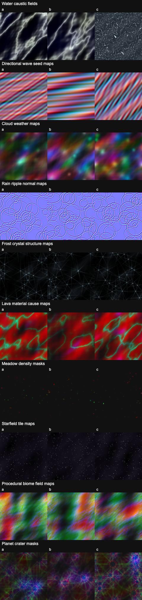

| Skill | Suggested generated assets | Useful for |
| --- | --- | --- |
| [`threejs-water-optics`](threejs-water-optics/SKILL.md) | `caustic-field-{a,b,c}.png` | Caustic floor projection, shallow-water intensity fields, and diagnostics. |
| [`threejs-spectral-ocean`](threejs-spectral-ocean/SKILL.md) | `directional-wave-seed-{a,b,c}.png` | Preview height/slope seeds and ocean normal-debug experiments. |
| [`threejs-volumetric-clouds`](threejs-volumetric-clouds/SKILL.md) | `weather-map-{a,b,c}.png` | Packed RGBA coverage, cloud type/detail, vertical bias, and erosion inputs. |
| [`threejs-rain-snow-and-wet-surfaces`](threejs-rain-snow-and-wet-surfaces/SKILL.md) | `ripple-normal-{a,b,c}.png` | RGBA `NoColorSpace` ripple normals for wet-surface diagnostics and explicitly stylized static tiers. |
| [`threejs-dynamic-surface-effects`](threejs-dynamic-surface-effects/SKILL.md) | `frost-crystal-{a,b,c}.png` | Frost/thaw masks, crystalline structure targets, and refraction-normal derivation. |
| [`threejs-procedural-materials`](threejs-procedural-materials/SKILL.md) | `lava-cause-{a,b,c}.png` | Packed rock, crack, emission, and grain cause maps for material-channel debugging. |
| [`threejs-procedural-vegetation`](threejs-procedural-vegetation/SKILL.md) | `meadow-density-{a,b,c}.png` | Packed density, path, clump, and flower masks for grass and meadow placement. |
| [`threejs-black-holes-and-space-effects`](threejs-black-holes-and-space-effects/SKILL.md) | `starfield-tile-{a,b,c}.png` | Tileable star/debug backgrounds for space-effect prototypes. |
| [`threejs-procedural-fields`](threejs-procedural-fields/SKILL.md) | `biome-field-{a,b,c}.png` | Packed altitude, moisture, wear, and biome fields for CPU/GPU parity tests. |
| [`threejs-procedural-planets`](threejs-procedural-planets/SKILL.md) | `crater-mask-{a,b,c}.png` | RGBA `NoColorSpace` crater masks for reduced-tier spherical projection and material diagnostics. |

### Three.js Water Caustic Field Validation Screenshots

The water optics pilot validates generated caustic fields as reduced-tier
`NoColorSpace` data for shallow bounded-water floor projection. The screenshots
separate the dry floor, water without caustics, caustic-enabled variants,
caustic-only diagnostics, tiled seam stress, camera-distance checks, and
temporal caustic drift.

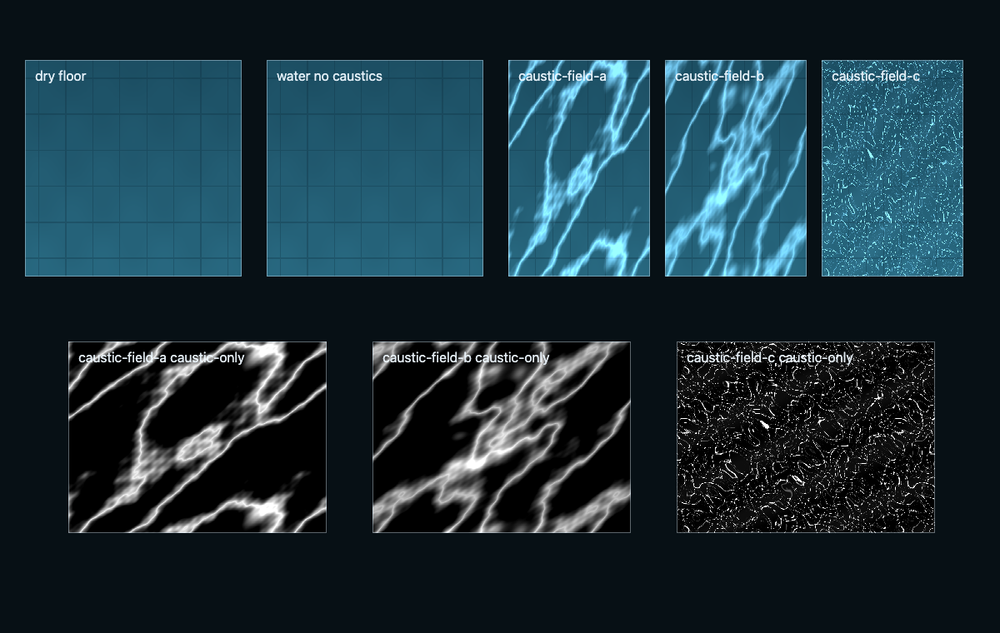

Final design: compares dry and wet baselines with each generated caustic
variant and caustic-only contribution.

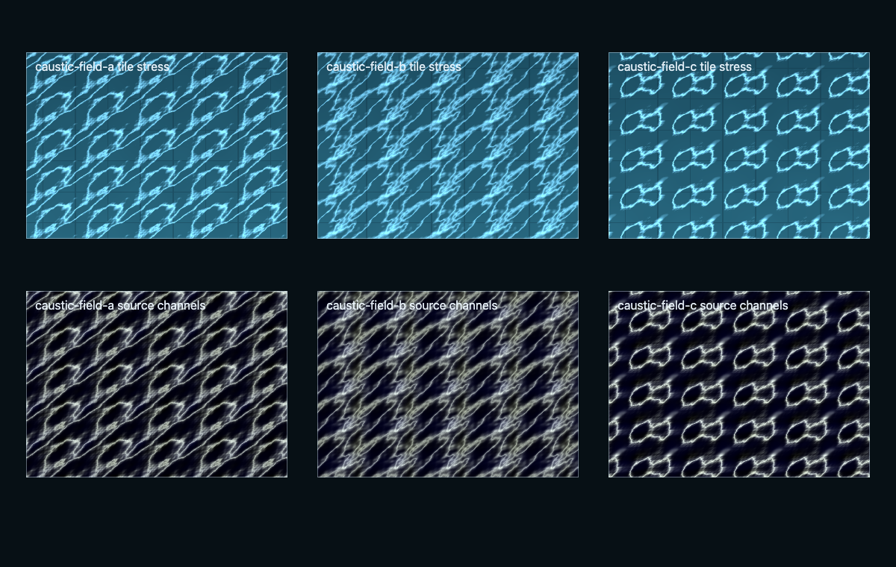

Diagnostics mosaic: exposes tiled seam stress and source-channel behavior for
all caustic variants.

| Capture | Screenshot |
| --- | --- |
| Final design | [final.design.png](docs/visual-validation/water-generated-caustics/final.design.png) |
| No-post/baseline | [no-post.design.png](docs/visual-validation/water-generated-caustics/no-post.design.png) |
| Diagnostics mosaic | [diagnostics.mosaic.png](docs/visual-validation/water-generated-caustics/diagnostics.mosaic.png) |
| Near camera | [camera.near.png](docs/visual-validation/water-generated-caustics/camera.near.png) |
| Design camera | [camera.design.png](docs/visual-validation/water-generated-caustics/camera.design.png) |
| Far camera | [camera.far.png](docs/visual-validation/water-generated-caustics/camera.far.png) |
| Seed baseline | [seed-0001.final.png](docs/visual-validation/water-generated-caustics/seed-0001.final.png) |
| Stress seed | [seed-stress.final.png](docs/visual-validation/water-generated-caustics/seed-stress.final.png) |
| Temporal start | [temporal.t000.png](docs/visual-validation/water-generated-caustics/temporal.t000.png) |
| Temporal response | [temporal.t001.png](docs/visual-validation/water-generated-caustics/temporal.t001.png) |

### Three.js Spectral Ocean Wave Seed Validation Screenshots

The spectral ocean pilot checks generated directional wave seeds as
reduced-tier `NoColorSpace` data for ocean diagnostics. The screenshots show
height response, slope/Jacobian diagnostics, tiled stress, camera-distance
checks, and phase progression; they do not validate the separate FFT spectrum
renderer.

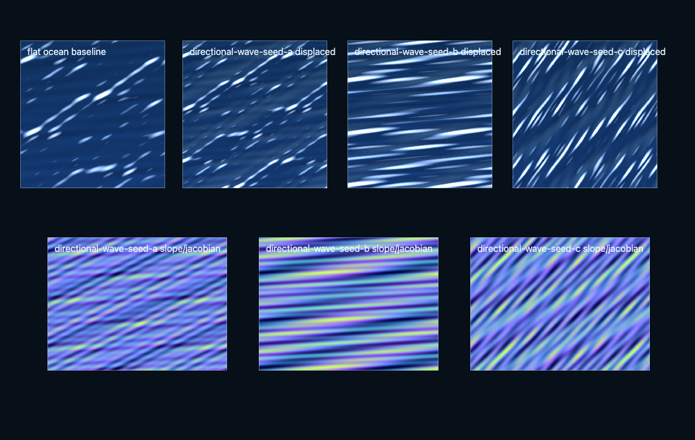

Final design: compares the flat ocean baseline with each generated directional
wave seed and its slope/Jacobian diagnostic.

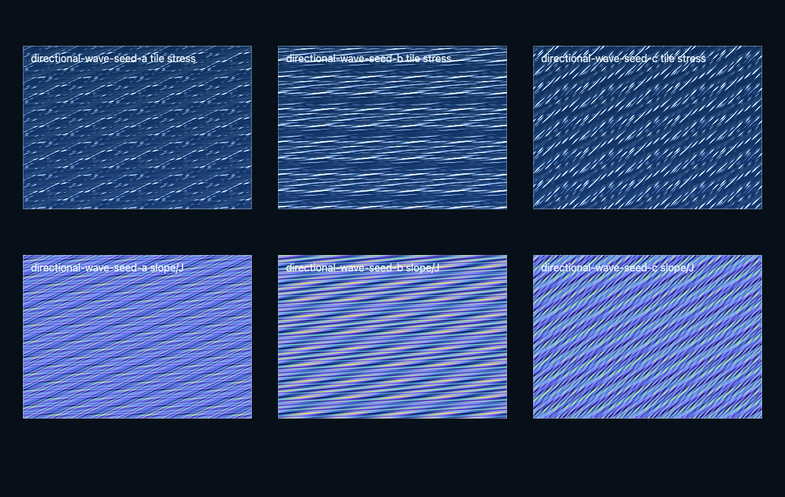

Diagnostics mosaic: exposes tiled directional stress and slope/Jacobian response
for every wave seed.

| Capture | Screenshot |
| --- | --- |
| Final design | [final.design.png](docs/visual-validation/ocean-generated-wave-seeds/final.design.png) |
| No-post/baseline | [no-post.design.png](docs/visual-validation/ocean-generated-wave-seeds/no-post.design.png) |
| Diagnostics mosaic | [diagnostics.mosaic.png](docs/visual-validation/ocean-generated-wave-seeds/diagnostics.mosaic.png) |
| Near camera | [camera.near.png](docs/visual-validation/ocean-generated-wave-seeds/camera.near.png) |
| Design camera | [camera.design.png](docs/visual-validation/ocean-generated-wave-seeds/camera.design.png) |
| Far camera | [camera.far.png](docs/visual-validation/ocean-generated-wave-seeds/camera.far.png) |
| Seed baseline | [seed-0001.final.png](docs/visual-validation/ocean-generated-wave-seeds/seed-0001.final.png) |
| Stress seed | [seed-stress.final.png](docs/visual-validation/ocean-generated-wave-seeds/seed-stress.final.png) |
| Temporal start | [temporal.t000.png](docs/visual-validation/ocean-generated-wave-seeds/temporal.t000.png) |
| Temporal response | [temporal.t001.png](docs/visual-validation/ocean-generated-wave-seeds/temporal.t001.png) |

### Three.js Volumetric Cloud Weather Map Validation Screenshots

The volumetric cloud pilot checks generated weather maps as reduced-tier RGBA
`NoColorSpace` data for cloud diagnostics. The screenshots show coverage,
cloud type/detail, vertical bias, and alpha erosion behavior; they do not prove
the separate volumetric lighting, shadow, or temporal renderer.

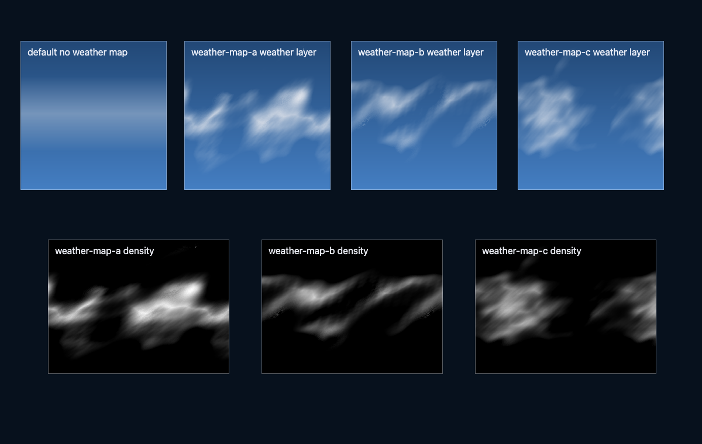

Final design: compares a no-weather density baseline with each generated
weather-map variant and its applied cloud-density diagnostic.

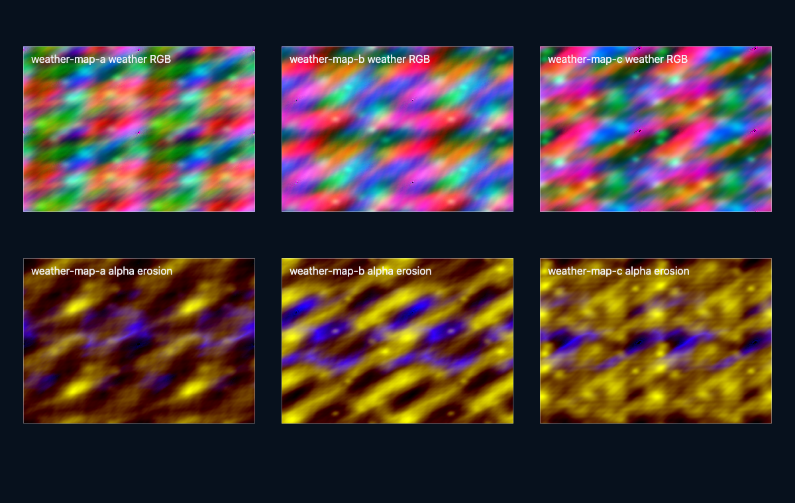

Diagnostics mosaic: exposes RGB weather fields and semantic alpha erosion for
all weather-map variants.

| Capture | Screenshot |
| --- | --- |
| Final design | [final.design.png](docs/visual-validation/cloud-generated-weather-maps/final.design.png) |
| No-post/baseline | [no-post.design.png](docs/visual-validation/cloud-generated-weather-maps/no-post.design.png) |
| Diagnostics mosaic | [diagnostics.mosaic.png](docs/visual-validation/cloud-generated-weather-maps/diagnostics.mosaic.png) |
| Near camera | [camera.near.png](docs/visual-validation/cloud-generated-weather-maps/camera.near.png) |
| Design camera | [camera.design.png](docs/visual-validation/cloud-generated-weather-maps/camera.design.png) |
| Far camera | [camera.far.png](docs/visual-validation/cloud-generated-weather-maps/camera.far.png) |
| Seed baseline | [seed-0001.final.png](docs/visual-validation/cloud-generated-weather-maps/seed-0001.final.png) |
| Stress seed | [seed-stress.final.png](docs/visual-validation/cloud-generated-weather-maps/seed-stress.final.png) |
| Temporal start | [temporal.t000.png](docs/visual-validation/cloud-generated-weather-maps/temporal.t000.png) |
| Temporal response | [temporal.t001.png](docs/visual-validation/cloud-generated-weather-maps/temporal.t001.png) |

### Three.js Dynamic Surface Frost Crystal Validation Screenshots

The dynamic surface pilot checks generated frost crystal maps as reduced-tier
RGBA `NoColorSpace` data for touch-history frost diagnostics. The screenshots
show crystal-driven mask/detail response, derived refraction normals, opaque
alpha padding, and touch-history clearing; they do not prove the separate
StorageTexture update, reconstruction, or TSL refraction graph.

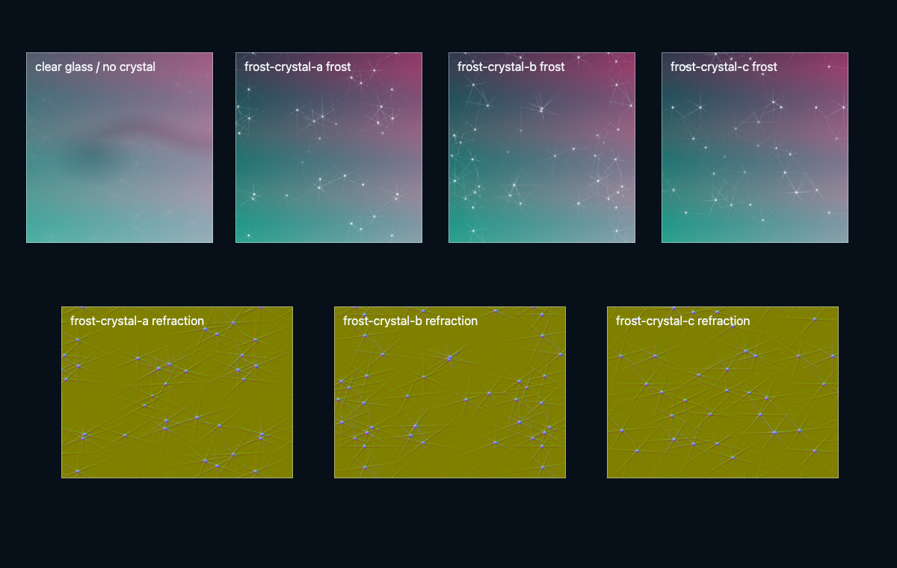

Final design: compares clear glass with each generated frost-crystal variant
and its derived refraction diagnostic.

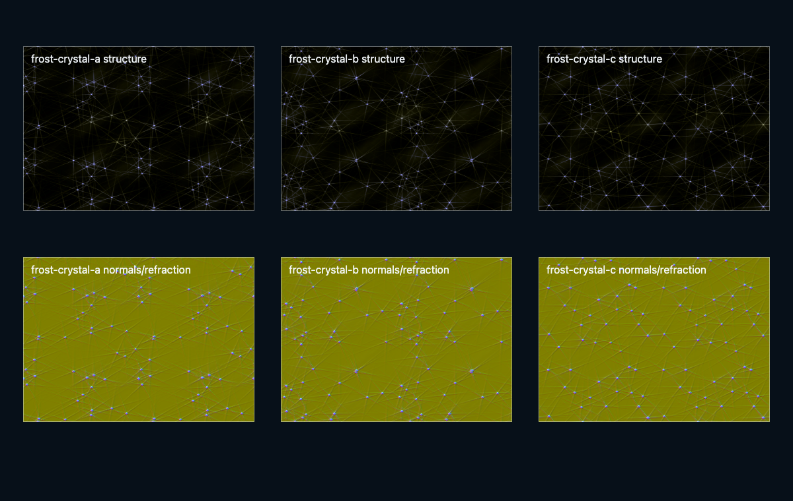

Diagnostics mosaic: exposes structure/detail/visible channels and
normal/refraction response for every frost-crystal variant.

| Capture | Screenshot |
| --- | --- |
| Final design | [final.design.png](docs/visual-validation/frost-generated-crystals/final.design.png) |
| No-post/baseline | [no-post.design.png](docs/visual-validation/frost-generated-crystals/no-post.design.png) |
| Diagnostics mosaic | [diagnostics.mosaic.png](docs/visual-validation/frost-generated-crystals/diagnostics.mosaic.png) |
| Near camera | [camera.near.png](docs/visual-validation/frost-generated-crystals/camera.near.png) |
| Design camera | [camera.design.png](docs/visual-validation/frost-generated-crystals/camera.design.png) |
| Far camera | [camera.far.png](docs/visual-validation/frost-generated-crystals/camera.far.png) |
| Seed baseline | [seed-0001.final.png](docs/visual-validation/frost-generated-crystals/seed-0001.final.png) |
| Stress seed | [seed-stress.final.png](docs/visual-validation/frost-generated-crystals/seed-stress.final.png) |
| Temporal start | [temporal.t000.png](docs/visual-validation/frost-generated-crystals/temporal.t000.png) |
| Temporal response | [temporal.t001.png](docs/visual-validation/frost-generated-crystals/temporal.t001.png) |

### Three.js Procedural Material Lava Cause Validation Screenshots

The procedural-materials pilot checks generated lava cause maps as reduced-tier
RGBA `NoColorSpace` data for PBR material diagnostics. The screenshots show
crust coverage, fracture networks, heat exposure, semantic alpha thermal
intensity, roughness/normal variation, and raw emissive separation from final
material color inside this fixture.

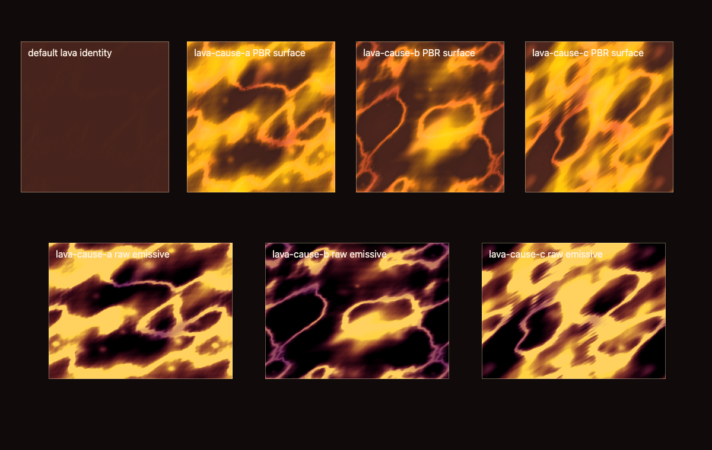

Final design: compares the default lava identity with each generated cause-map
PBR surface and raw emissive diagnostic.

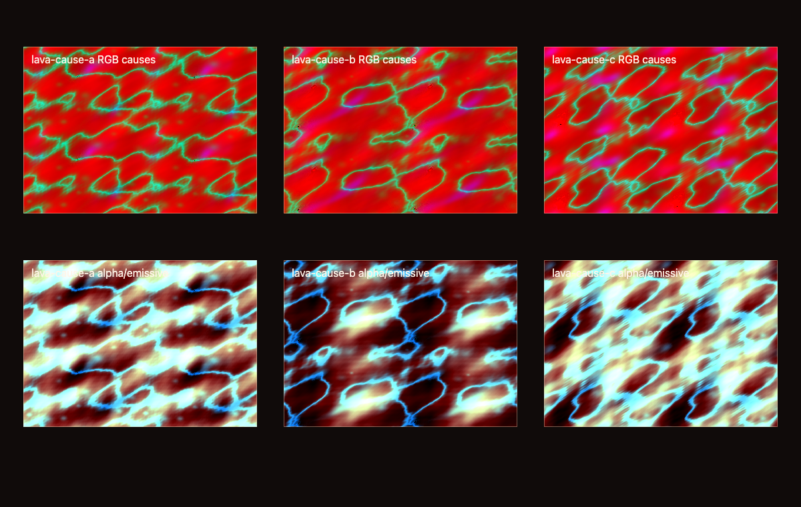

Diagnostics mosaic: exposes RGB causes and semantic alpha/emissive response for
all lava-cause variants.

| Capture | Screenshot |
| --- | --- |
| Final design | [final.design.png](docs/visual-validation/materials-generated-lava-causes/final.design.png) |
| No-post/baseline | [no-post.design.png](docs/visual-validation/materials-generated-lava-causes/no-post.design.png) |
| Diagnostics mosaic | [diagnostics.mosaic.png](docs/visual-validation/materials-generated-lava-causes/diagnostics.mosaic.png) |
| Near camera | [camera.near.png](docs/visual-validation/materials-generated-lava-causes/camera.near.png) |
| Design camera | [camera.design.png](docs/visual-validation/materials-generated-lava-causes/camera.design.png) |
| Far camera | [camera.far.png](docs/visual-validation/materials-generated-lava-causes/camera.far.png) |
| Seed baseline | [seed-0001.final.png](docs/visual-validation/materials-generated-lava-causes/seed-0001.final.png) |
| Stress seed | [seed-stress.final.png](docs/visual-validation/materials-generated-lava-causes/seed-stress.final.png) |
| Temporal start | [temporal.t000.png](docs/visual-validation/materials-generated-lava-causes/temporal.t000.png) |
| Temporal response | [temporal.t001.png](docs/visual-validation/materials-generated-lava-causes/temporal.t001.png) |

### Three.js Procedural Vegetation Meadow Density Validation Screenshots

The procedural-vegetation pilot checks generated meadow density maps as
reduced-tier RGBA `NoColorSpace` data for dense-grass placement diagnostics.
The screenshots show density-shaped placement, path clearing, clump/LOD
variation, semantic alpha flower masks, and shared-mask consistency between
diagnostics and final meadow color inside this fixture.

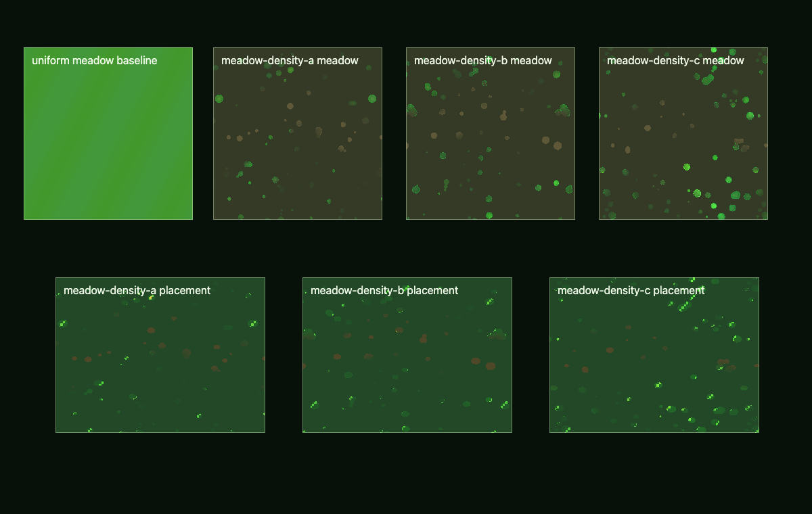

Final design: compares the uniform meadow baseline with each generated
meadow-density variant and placement diagnostic.

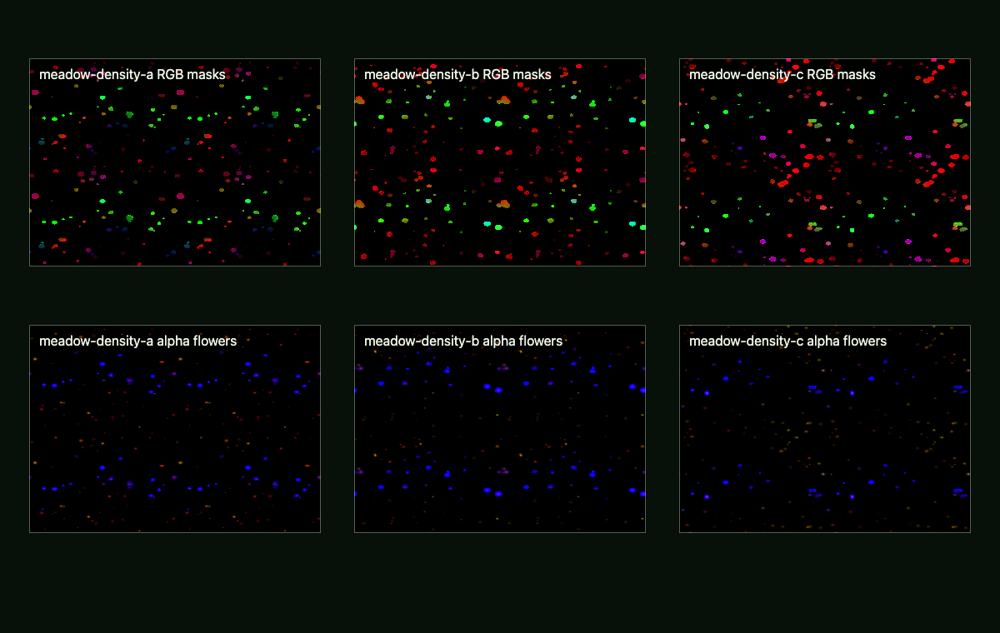

Diagnostics mosaic: exposes RGB density/path/clump masks and semantic alpha
flower response for every meadow-density variant.

| Capture | Screenshot |
| --- | --- |
| Final design | [final.design.png](docs/visual-validation/vegetation-generated-meadow-density/final.design.png) |
| No-post/baseline | [no-post.design.png](docs/visual-validation/vegetation-generated-meadow-density/no-post.design.png) |
| Diagnostics mosaic | [diagnostics.mosaic.png](docs/visual-validation/vegetation-generated-meadow-density/diagnostics.mosaic.png) |
| Near camera | [camera.near.png](docs/visual-validation/vegetation-generated-meadow-density/camera.near.png) |
| Design camera | [camera.design.png](docs/visual-validation/vegetation-generated-meadow-density/camera.design.png) |
| Far camera | [camera.far.png](docs/visual-validation/vegetation-generated-meadow-density/camera.far.png) |
| Seed baseline | [seed-0001.final.png](docs/visual-validation/vegetation-generated-meadow-density/seed-0001.final.png) |
| Stress seed | [seed-stress.final.png](docs/visual-validation/vegetation-generated-meadow-density/seed-stress.final.png) |
| Temporal start | [temporal.t000.png](docs/visual-validation/vegetation-generated-meadow-density/temporal.t000.png) |
| Temporal response | [temporal.t001.png](docs/visual-validation/vegetation-generated-meadow-density/temporal.t001.png) |

### Three.js Curved-Ray Starfield Tile Validation Screenshots

The black-holes and space-effects pilot checks generated starfield tiles as
RGBA `SRGBColorSpace` environment color for curved-ray background diagnostics.
The screenshots show opaque alpha padding, raw star-tile lookup,
final-direction lens response, bent-direction diagnostics, and
termination/opacity views inside this artistic fixture.

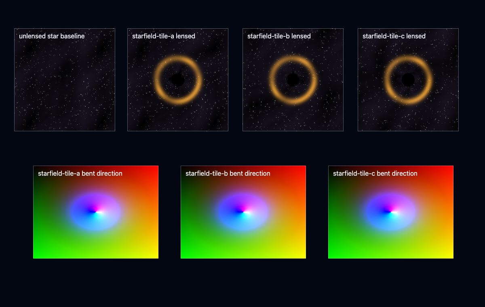

Final design: compares the unlensed star baseline with each generated
starfield-tile variant after final-direction lookup and bent-direction
diagnostics.

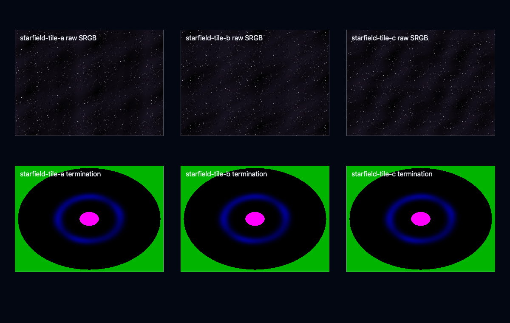

Diagnostics mosaic: exposes raw SRGB star tiles and termination/opacity views
for every starfield variant.

| Capture | Screenshot |
| --- | --- |
| Final design | [final.design.png](docs/visual-validation/space-generated-starfields/final.design.png) |
| No-post/baseline | [no-post.design.png](docs/visual-validation/space-generated-starfields/no-post.design.png) |
| Diagnostics mosaic | [diagnostics.mosaic.png](docs/visual-validation/space-generated-starfields/diagnostics.mosaic.png) |
| Near camera | [camera.near.png](docs/visual-validation/space-generated-starfields/camera.near.png) |
| Design camera | [camera.design.png](docs/visual-validation/space-generated-starfields/camera.design.png) |
| Far camera | [camera.far.png](docs/visual-validation/space-generated-starfields/camera.far.png) |
| Seed baseline | [seed-0001.final.png](docs/visual-validation/space-generated-starfields/seed-0001.final.png) |
| Stress seed | [seed-stress.final.png](docs/visual-validation/space-generated-starfields/seed-stress.final.png) |
| Temporal start | [temporal.t000.png](docs/visual-validation/space-generated-starfields/temporal.t000.png) |
| Temporal response | [temporal.t001.png](docs/visual-validation/space-generated-starfields/temporal.t001.png) |

### Three.js Procedural Field Biome Map Validation Screenshots

The procedural-fields pilot checks generated biome field maps as reduced-tier
RGBA `NoColorSpace` data for field diagnostics. The screenshots show macro
height, ridge, cavity, semantic alpha moisture, field-shaped biome material
response, and derived slope/place/roughness diagnostics inside this fixture.

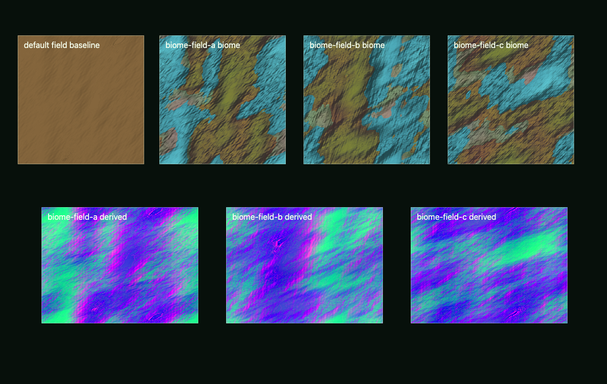

Final design: compares the default field baseline with each generated biome
field variant and derived-channel diagnostic.

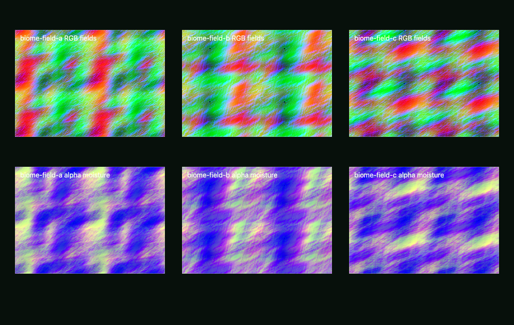

Diagnostics mosaic: exposes RGB height/ridge/cavity fields and semantic alpha
moisture response for every biome variant.

| Capture | Screenshot |
| --- | --- |
| Final design | [final.design.png](docs/visual-validation/fields-generated-biome-maps/final.design.png) |
| No-post/baseline | [no-post.design.png](docs/visual-validation/fields-generated-biome-maps/no-post.design.png) |
| Diagnostics mosaic | [diagnostics.mosaic.png](docs/visual-validation/fields-generated-biome-maps/diagnostics.mosaic.png) |
| Near camera | [camera.near.png](docs/visual-validation/fields-generated-biome-maps/camera.near.png) |
| Design camera | [camera.design.png](docs/visual-validation/fields-generated-biome-maps/camera.design.png) |
| Far camera | [camera.far.png](docs/visual-validation/fields-generated-biome-maps/camera.far.png) |
| Seed baseline | [seed-0001.final.png](docs/visual-validation/fields-generated-biome-maps/seed-0001.final.png) |
| Stress seed | [seed-stress.final.png](docs/visual-validation/fields-generated-biome-maps/seed-stress.final.png) |
| Temporal start | [temporal.t000.png](docs/visual-validation/fields-generated-biome-maps/temporal.t000.png) |
| Temporal response | [temporal.t001.png](docs/visual-validation/fields-generated-biome-maps/temporal.t001.png) |

### Three.js Rain Ripple Normal Validation Screenshots

The rain and wet-surfaces pilot validates generated ripple normal maps as
`NoColorSpace` wet-surface normal data. The screenshots show dry asphalt, wet
asphalt without ripples, wet asphalt with each ripple variant, normal-field
diagnostics, camera-distance checks, stress views, and temporal wetness gating.
This evidence is meant to teach how the `threejs-rain-snow-and-wet-surfaces`
skill applies generated ripple textures to a real material response.


Final design: compares dry asphalt, wet asphalt without ripple normals, wet
asphalt with each generated ripple-normal variant, and normal-map diagnostics.

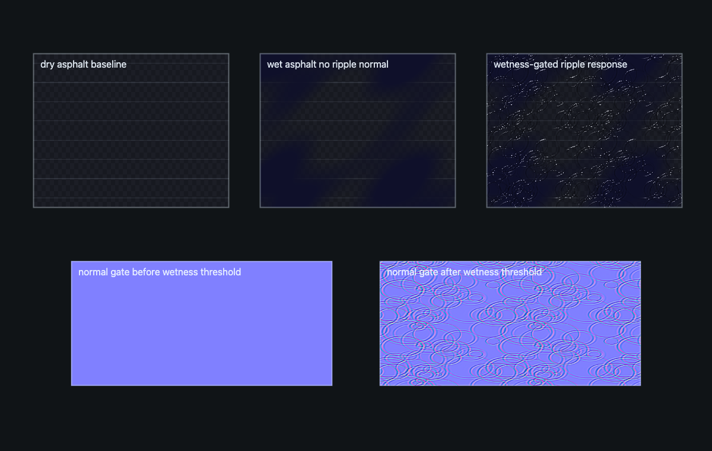

No-post baseline: isolates the fixture's wet-surface response from
post-processing and the final beauty framing.


Diagnostics mosaic: exposes normal fields and tile-seam stress for every ripple
variant.

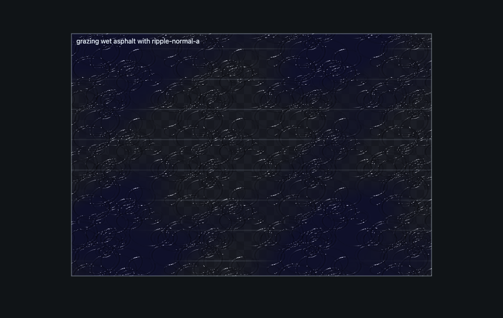

Near camera: checks close inspection of wet asphalt highlight response.

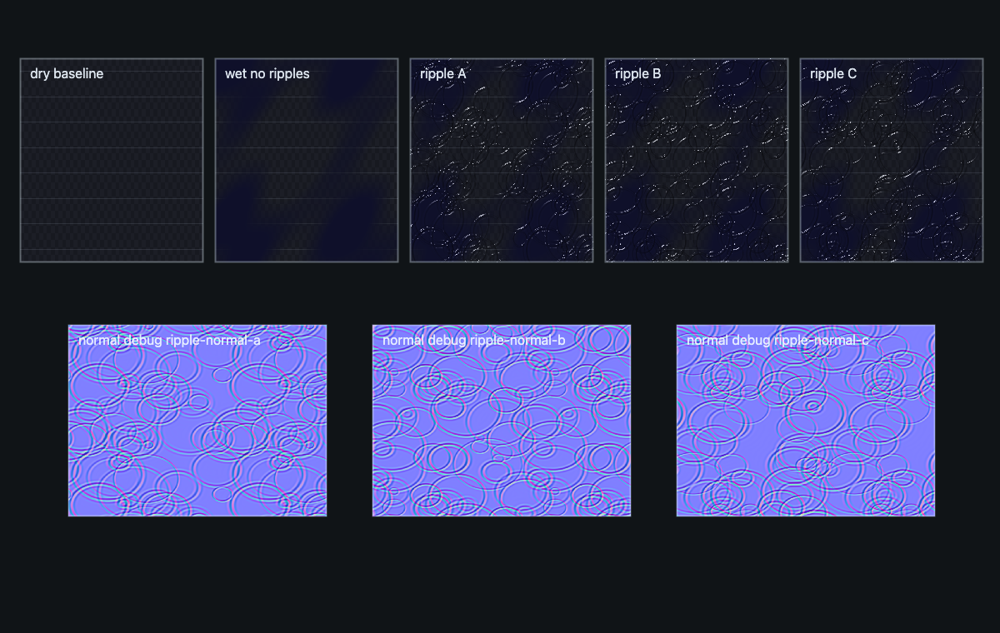

Design camera: repeats the authored review framing for regression comparison.


Far camera: checks minified and tiled ripple-normal behavior.


Seed baseline: records the fixed deterministic seed used by the evidence
bundle.

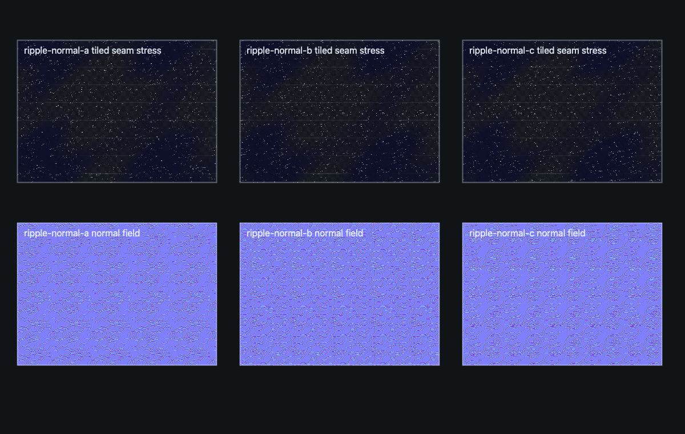

Stress seed: increases tiling pressure so seam problems are visible.

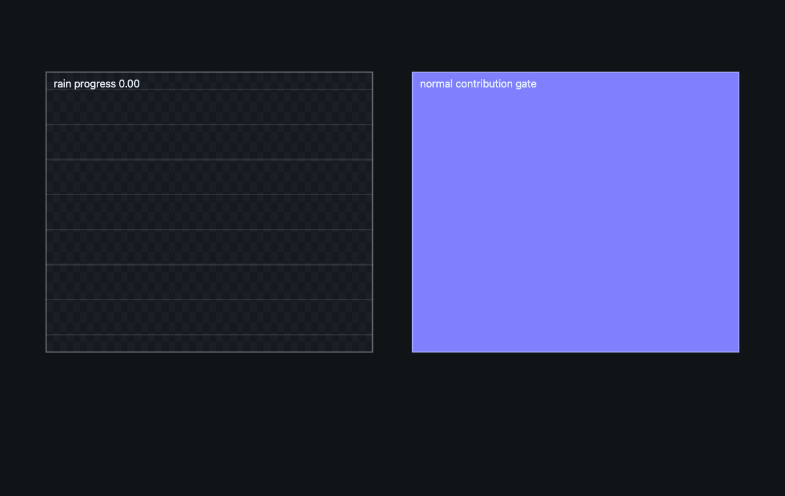

Temporal start: shows the wetness gate before ripple normals contribute.


Temporal response: shows ripple normals only after the wetness state reaches the
normal-response band.

| Capture | Screenshot |
| --- | --- |
| Final design | [final.design.png](docs/visual-validation/rain-generated-ripples/final.design.png) |
| No-post/baseline | [no-post.design.png](docs/visual-validation/rain-generated-ripples/no-post.design.png) |
| Diagnostics mosaic | [diagnostics.mosaic.png](docs/visual-validation/rain-generated-ripples/diagnostics.mosaic.png) |
| Near camera | [camera.near.png](docs/visual-validation/rain-generated-ripples/camera.near.png) |
| Design camera | [camera.design.png](docs/visual-validation/rain-generated-ripples/camera.design.png) |
| Far camera | [camera.far.png](docs/visual-validation/rain-generated-ripples/camera.far.png) |
| Seed baseline | [seed-0001.final.png](docs/visual-validation/rain-generated-ripples/seed-0001.final.png) |
| Stress seed | [seed-stress.final.png](docs/visual-validation/rain-generated-ripples/seed-stress.final.png) |
| Temporal start | [temporal.t000.png](docs/visual-validation/rain-generated-ripples/temporal.t000.png) |
| Temporal response | [temporal.t001.png](docs/visual-validation/rain-generated-ripples/temporal.t001.png) |

### Three.js Procedural Planet Crater Mask Validation Screenshots

The procedural planet pilot validates generated crater-mask PNGs on spherical
and close-patch terrain views. The screenshots show that crater masks are used
as `NoColorSpace` data for projected planet material and diagnostics, not as
flat color thumbnails. This evidence is meant to teach how the
`threejs-procedural-planets` skill applies crater masks to spherical projection,
height/material response, channel diagnostics, and projection stress.

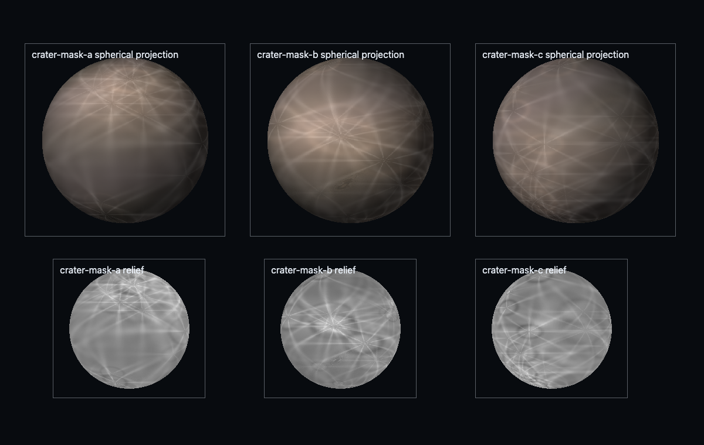

Final design: shows each generated crater-mask variant on orbit-scale spherical
views and close terrain patches.

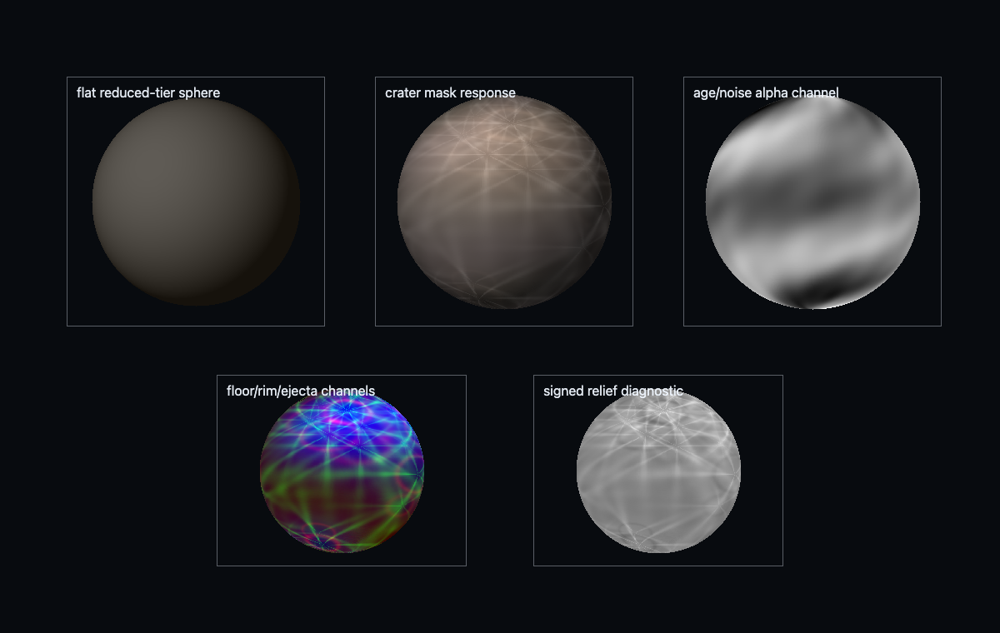

No-post baseline: keeps crater interpretation reviewable without presentation
effects hiding weak geometry or material response.

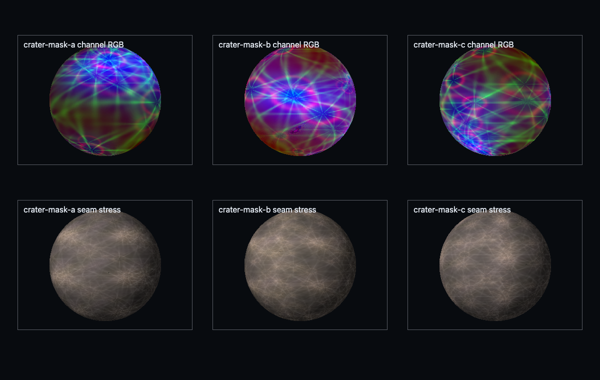

Diagnostics mosaic: exposes crater channel behavior and height/material views.

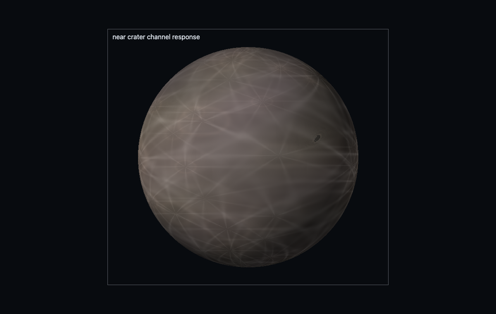

Near camera: checks close crater-ring and floor/rim material response.


Design camera: repeats the authored orbit and close-patch review framing.


Far camera: checks that crater masks remain legible at reduced orbit scale.


Seed baseline: records the deterministic crater-mask state used by the evidence
bundle.


Stress seed: exposes channel/projection behavior under diagnostic pressure.

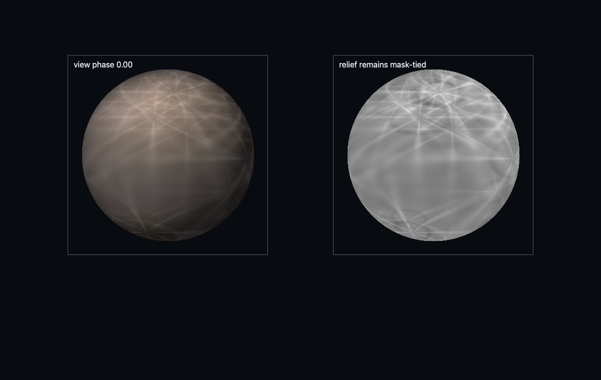

State start: captures the lower projection-scale state.

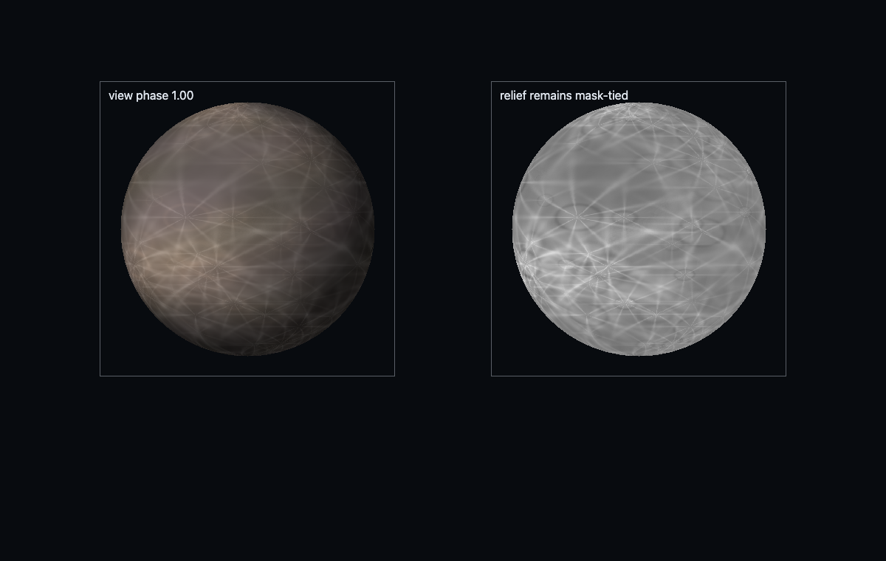

State response: captures the higher projection-scale stress state for comparison.

| Capture | Screenshot |
| --- | --- |
| Final design | [final.design.png](docs/visual-validation/planet-generated-craters/final.design.png) |
| No-post/baseline | [no-post.design.png](docs/visual-validation/planet-generated-craters/no-post.design.png) |
| Diagnostics mosaic | [diagnostics.mosaic.png](docs/visual-validation/planet-generated-craters/diagnostics.mosaic.png) |
| Near camera | [camera.near.png](docs/visual-validation/planet-generated-craters/camera.near.png) |
| Design camera | [camera.design.png](docs/visual-validation/planet-generated-craters/camera.design.png) |
| Far camera | [camera.far.png](docs/visual-validation/planet-generated-craters/camera.far.png) |
| Seed baseline | [seed-0001.final.png](docs/visual-validation/planet-generated-craters/seed-0001.final.png) |
| Stress seed | [seed-stress.final.png](docs/visual-validation/planet-generated-craters/seed-stress.final.png) |
| Temporal/state start | [temporal.t000.png](docs/visual-validation/planet-generated-craters/temporal.t000.png) |
| Temporal/state response | [temporal.t001.png](docs/visual-validation/planet-generated-craters/temporal.t001.png) |

## Repository Layout

Each skill is a standalone folder:

```text
threejs-skill-name/
  SKILL.md                 Required skill metadata and core guidance
  references/              Deeper technical guidance loaded only when needed
  examples/                Runnable or inspectable implementation examples
  assets/                  Visual assets used by examples or generated outputs
  review.md                Audit notes and improvement context where present
```

Top-level reports such as [`SKILL_QUALITY_BAR.md`](SKILL_QUALITY_BAR.md),
[`IMPROVEMENT_PLAN.md`](IMPROVEMENT_PLAN.md), and
[`FINAL_REPORT.md`](FINAL_REPORT.md) document the quality bar, review history,
and migration context for the pack.

## Requirements

- A skill-aware agent runtime such as Codex, Claude, or another compatible agent
  shell that can load local skill folders.
- Node.js for examples and local Three.js inspection.
- Three.js `^0.185.1` as pinned in [`package.json`](package.json).
- A browser/device with WebGPU support for full runtime validation.

Install package dependencies when working with examples:

```bash
npm install
```

## Validation

This repository does not currently ship a single top-level validation command.
After edits, run the checks that match the files you touched:

```bash
npm install
node threejs-choose-skills/examples/router-contract.test.mjs

find . -name node_modules -prune -o -name '*.mjs' -print \
  -exec node --check {} \;
```

A good change also checks:

- Skill folder name matches `name:` in `SKILL.md`.
- `SKILL.md` frontmatter has a precise `description:` trigger.
- Cross-skill links point to current folders.
- Examples still parse or run at their stated level.
- No obsolete WebGL path is presented as the flagship implementation.

## Design Philosophy

The skills are intentionally opinionated:

- Use plain names where possible so non-experts can find the right capability.
- Keep expert terms in descriptions and references where they help precision.
- Prefer one coherent visual mechanism over layered noise and post-processing.
- Keep compatibility work quarantined until explicitly requested.
- Treat validation evidence as part of the implementation, not polish at the end.

## Contributing

When adding or revising a skill:

1. Keep the name descriptive enough for a non-expert to discover it.
2. Keep `SKILL.md` concise and move deep technical material into `references/`.
3. Add examples only when they are runnable, inspectable, or directly useful.
4. Validate the skill metadata before committing.
5. Update this README when a skill is added, removed, or renamed.

## Status

This pack is actively evolving around current Three.js WebGPU and TSL APIs.
Treat checked-in skill files, references, examples, and validation notes as the
source of truth for project-specific behavior.
